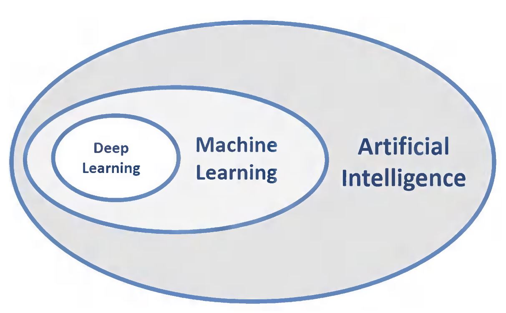
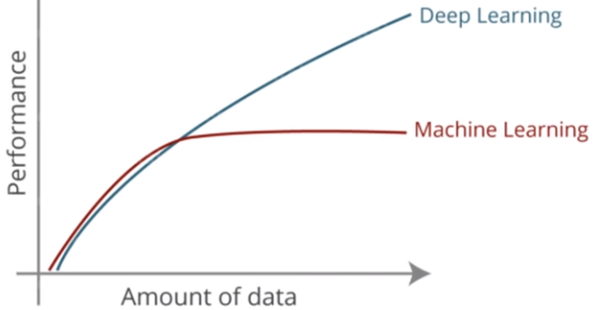

# Artificial Intelligence Notes

### AI vs ML vs DL:

#### AI,ML,DL

* AI was first coined in 1956

* AI is a technique which enables **machines to mimic human behaviour**

* ML - late 80's and 90's

* ML is a subset of AI technique which use **statistical methods to enable machines to improve with experience**

* DL is a particular kind of ML that is inspired by the functionality of our brain cells call neurons which lead to concept of artificial neural network

* DL is ML

	

#### ML vs DL

|                          | ML                                                           | DL                                                           |
| ------------------------ | ------------------------------------------------------------ | ------------------------------------------------------------ |
| Data Dependency          | ML can work with small amount of data                        | DL performs better with large amount of data because it needs large amount of data to understand it perfectly |
| Feature Engineering      | Features have to be find out by domain expert and performance of ML algorithms depend on how accurately the features are identified and extracted | DL automatically find the features that are most import for classification |
| Hardware dependency      | low end machines                                             | High end machines, GPU's because DL involves matrix multiplications which can be optimized by GPU |
| Problem solving approach | end to end problem solving                                   | splits problems into subproblems and solves them(example: object detection + object recognition) |
| Training time            | less time ranging from few weeks to hours                    | takes more time for training because there are more features(example: training may take two weeks) |
| Execution time           | time increases with data increases                           | less time to run                                             |

​                                       

​                                         ***ML vs DL Peformance wrt amount of data***

