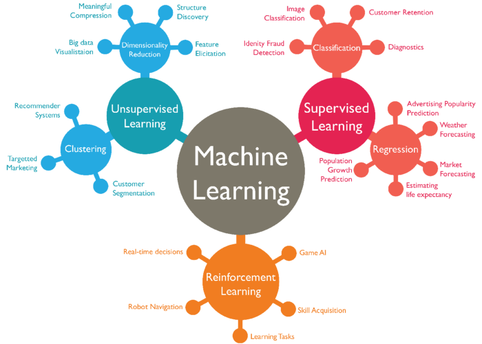
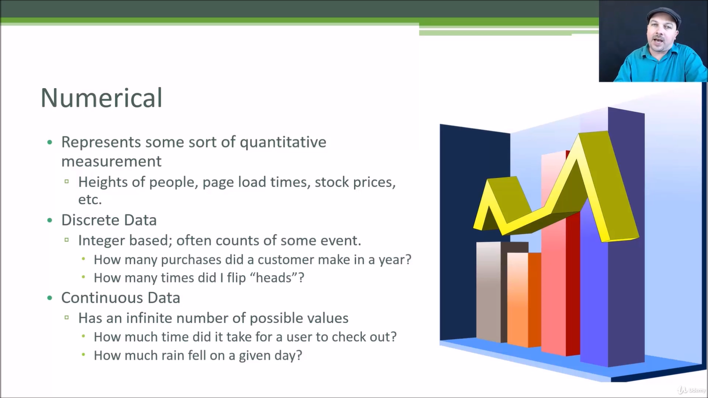
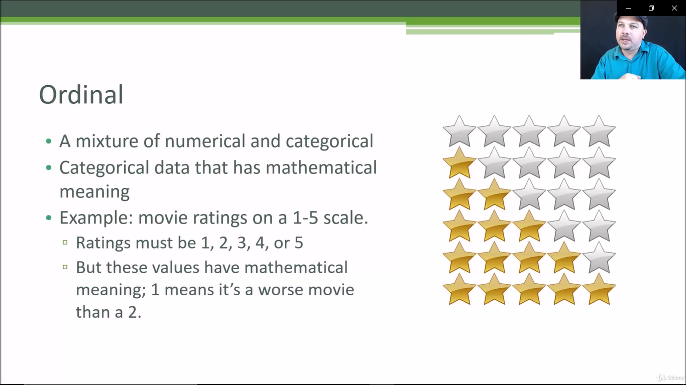

# Machine Learning Notes

### Real World applications of ML

- Face Recognition
- Voice Recognition
- Healthcare industry
- Weather Forecasting

## ML Types

* Supervised ML(task driven)
* Unsupervised ML(data driven)
* Reinforcement ML(environment/agent)

  

## Feature Engineering

`FE is the process of putting domain knowledge to reduce the complexity of data and make patterns more visible to learning algorithms`

## Data Types

### 1.Numerical

### 2.Categorical

​      

### 3.Ordinal

## Recommendation Systems

- Content filtering recommender systems
- Collaborative filtering based recommender systems

<u>Note : Netflix‘s recommender system filtering architecture bases on collaborative filtering</u>

### Content Filtering

### Collaborative Filtering

- Collaborative filtering is a technique that can filter out items that a user might like on the basis of reactions by similar users.
- It works by searching a large group of people and finding a smaller set of users with tastes similar to a particular user. It looks at the items they like and combines them to create a ranked list of suggestions.

	

