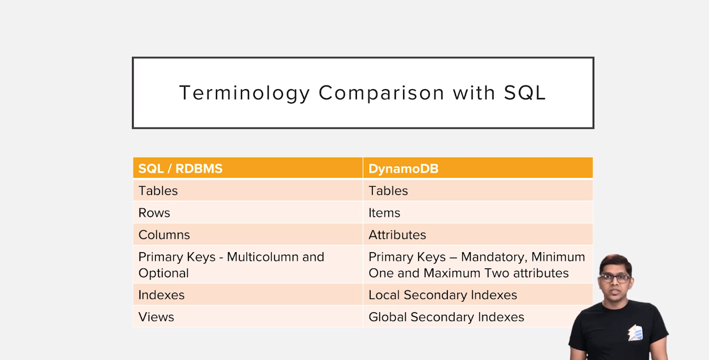

# AWS Dynamodb

#### Big Data Characteristics
- High Volume
- High Variety
- High Velocity

#### Dynamodb is
- Serverless(no need to maintain server or infrastructure as dynamodb is a fully managed service)
- Cloud(is available only as a service from aws cloud)
- NoSQL
- Fast
- Flexible(no schema )
- Cost Effective(pay as per use)
- Highly Scalable
- Fault Tolerant
- Secure

#### SQL DB vs DynamoDB

#### Dynamodb basics
- Dynamodb has no concept of having multiple databases
- Tables are the top level entities in dynamodb
- All tables at a given aws region can be looked as a single database
- Tables are 
    - Top level entities
    - Independent Entities
    - Flexible Schema
- Table naming conventions
    - You cannot have two tables with the same name in same aws region
    - Use prefix.table_name or prefix_table_name while naming tables for ease
        - Eg: test.users, test_users
    - We donot have a concept of foreign key releations in dynamodb tables
        - Improves query performance as no joins
        - Also we can provision whatever required capacity for the table
    - No strict schema for tables as we see in sql databases
    - Only mandatory common attribute in dynamodb table is primary key
