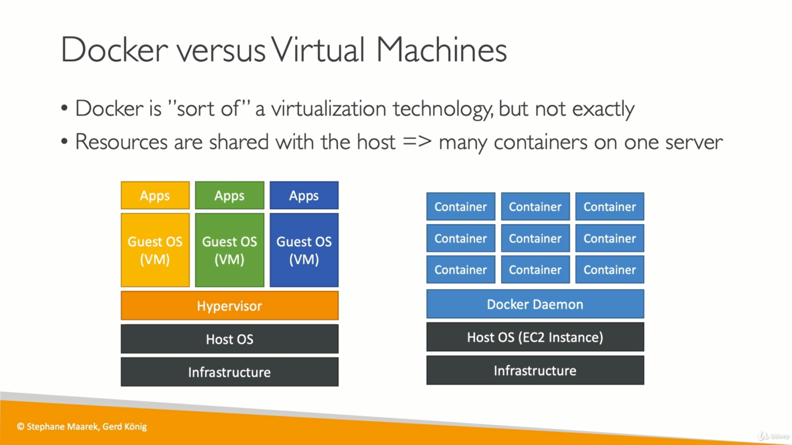

# Docker Notes


### Docker Installation

1. For linux ubunutu,
> https://www.digitalocean.com/community/tutorials/how-to-install-and-use-docker-on-ubuntu-18-04

### Docker references
1. [Udemy Docker-and-Kubernetes-The-Complete-Guide](https://github.com/StephenGrider/DockerCasts)

### Linux features which are key for container world
- Namespaces
- Cgroups


##### Namespaces
- Namespaces have been part of the Linux kernel since about 2002, and over time more tooling and namespace types have been added. 
- Real container support was added to the Linux kernel only in 2013, however. This is what made namespaces really useful and brought them to the masses.
- Namespaces are a feature of the Linux kernel that partitions kernel resources such that one set of processes sees one set of resources while another set 	     of processes sees a different set of resources.
-  **key feature of namespaces is that they isolate processes from each other**


##### Types of Namespaces
Within the Linux kernel, there are different types of namespaces. Each namespace has its own unique properties:

- user namespace : has its own set of user IDs and group IDs for assignment to processes. In particular, this means that a process can have root privilege within its user namespace without having it in other user namespaces.
-  process ID (PID) namespace : assigns a set of PIDs to processes that are independent from the set of PIDs in other namespaces. The first process created in a new namespace has PID 1 and child processes are assigned subsequent PIDs.
-  network namespace : has an independent network stack: its own private routing table, set of IP addresses, socket listing, connection tracking table, firewall, and other network‑related resources.
-  mount namespace  : has an independent list of mount points seen by the processes in the namespace. This means that you can mount and unmount filesystems in a mount namespace without affecting the host filesystem.
-  interprocess communication (IPC) namespace : has its own IPC resources, for example POSIX message queues.
- UNIX Time‑Sharing (UTS) namespace : allows a single system to appear to have different host and domain names to different processes.

##### Cgroups
A control group (cgroup) is a Linux kernel feature that limits, accounts for, and isolates the resource usage (CPU, memory, disk I/O, network, and so on) of a collection of processes

Cgroups provide the following features:

Resource limits – You can configure a cgroup to limit how much of a particular resource (memory or CPU, for example) a process can use.
Prioritization – You can control how much of a resource (CPU, disk, or network) a process can use compared to processes in another cgroup when there is resource contention.
Accounting – Resource limits are monitored and reported at the cgroup level.
Control – You can change the status (frozen, stopped, or restarted) of all processes in a cgroup with a single command.

### Docker vs Virtual Machines
|                   VirtualMachines Vs Docker     |
| :---------------------------------------------: |
|    |

### Docker Terminology
- Docker Image
  - Image = File System Snapshot + default run command
- Docker Run
  - 

### Docker Commands
- Check docker installation

```
docker version
```

- Get Docker information
```
docker info
```

- Run hello-world image
```
docker run hello-world
```

- List all docker images
```
docker images
```
- Override default run command
```
docker run busybox <override-command-here>

Eg:  docker run busybox echo hi there
```

- List all running containers
```
docker ps
```

- List all container ran till now and there status
```
docker ps --all
Eg:
root@linux:/home/bala# docker ps --all
CONTAINER ID        IMAGE               COMMAND             CREATED             STATUS                         PORTS               NAMES
904035cc9ad0        busybox             "ping google.com"   4 minutes ago       Exited (0) 9 seconds ago                           sleepy_shamir
3630c151ab75        busybox             "echo hi there"     10 minutes ago      Exited (0) 10 minutes ago                          pensive_ganguly
9c99caf87d2a        busybox             "ls"                12 minutes ago      Exited (0) 12 minutes ago                          naughty_margulis
64dda0d56dbf        busybox             "sh"                13 minutes ago      Exited (0) 12 minutes ago                          romantic_keller
f18e5aecdd72        busybox             "sh"                13 minutes ago      Exited (0) 13 minutes ago                          compassionate_buck
783ddc77ff89        hello-world         "/hello"            About an hour ago   Exited (0) About an hour ago                       boring_heyrovsky

```


### Docker Network Types

1. Closed Network/None Network(complete isolated from network, not attached to any network)
2. Bridge Network (network isolation between docker host and docker container, private internal network where application ports have to mapped to host ports for external access)
3. Host Network(no network isolation between docker host and docker container)
4. Overlay Network
- We can create docker network in a docker host which containers can user for communication
- To communicate with containers running with different docker host we can use overlay network in docker
- `Overlay Network` creates internal private network that spans across all the nodes participating in Swarm` cluster

- list all docker networks

	```
	docker network ls
	```

- inspect details of a specific network type

	```
	docker network inspect bridge
	```

	

- create a none network type container

	```
	docker run -d --net none busybox sleep 1000
	```

- create overlay network
	```
	1.create network that spans across all the nodes participating in swarm cluster
	docker network create --driver overlay --subnet 10.0.9.0/24 my-overlay-network
	
	2.attach containers or services to the above network while creating service
	docker service create --replicas 2 --network my-overlay-network nginx
	```
	
## Swarm Cluster
A Docker Swarm is a group of either physical or virtual machines that are running the Docker application and that have been configured to join together in a cluster.


What is Docker Swarm used for?
Docker swarm is a `container orchestration tool`, meaning that it allows the user to manage multiple containers deployed across multiple host machines.
