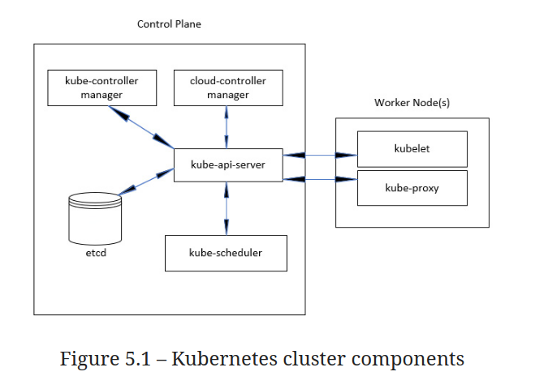

# Kubernetes Notes
This notes contains a cheatsheet of all kubernetes concepts collected from various resources

## Table of Contents
1. [References](#References)
2. [Kubernetes Components](#KubernetesComponents)
    - Pods
    - Services
    - Controllers
    - ConfigMaps And Secrets
    
4. [Learning Resources](#Learning)
5. [Additional Examples](#AddEx)


- Open source container orchestration tool
- Developed by Google
- Helps you manage containerized applications in different deployment environments like physical, virtual machines or cloud environments.


## References <a name="References"></a>
- AWS EKS workshop 
  - https://www.eksworkshop.com/010_introduction/basics/concepts_nodes/

## Kubernetes nodes
+ The machines that make up a Kubernetes cluster are called nodes.
+ Nodes in a Kubernetes cluster may be physical, or virtual.
+ There are two types of nodes:
  + A Control-plane-node type, which makes up the Control Plane, acts as the “brains” of the cluster.
  + A Worker-node type, which makes up the Data Plane, runs the actual container images (via pods).

+ Hence A Kubernetes cluster is split into two parts:
  + The Kubernetes Control Plane
  + The (worker) nodes


### Components of the Control Plane
The Control Plane is what controls and makes the whole cluster function. 
The components that make up the Control Plane are:
  ```
  The etcd distributed persistent storage
  The API server
  The Scheduler
  The Controller Manager
  ```
These components store and manage the state of the cluster, but they aren’t what runs the application containers.

### Components running on the worker nodes
The task of running your containers is up to the components running on each worker node:
```
The Kubelet
The Kubernetes Service Proxy (kube-proxy)
The Container Runtime (Docker, rkt, or others)
```

- kubectl
    - used in `managing containers` in the node
    - used in both development and production environments
    - ```kubectl cluster-info```

- minikube
    - used to `manage virtual machine` itself
    - used only in local development environment
    - ```minicube status```


## Kubernetes Components <a name="KubernetesComponents"></a>

|                   Kubernetes Components         |
| :---------------------------------------------: |
|  |

### Pods
- Smallest units of k8s
- Abstraction over container
- Usally 1 application per pod
- Each pod gets its own IP address(New IP address on re-creation of pod once its dies)

### Services
Getting Started with Communication

+ Since Pods are unreliable, short-lived, and volatile, we cannot assume that the database would always be accessible through the IP of a Pod. 
+ When that Pod gets destroyed (or fails), the ReplicaSet would create a new one and assign it a new address.
+ We need a stable, never-to-be-changed address that will forward requests to whichever Pod is currently running.

#### The Solution 
Kubernetes Services provide addresses through which associated Pods can be accessed.

Creating a cluster
```
cd k8s-specs

git pull

minikube start --vm-driver=virtualbox

kubectl config current-context
```

#### Sequential Breakdown of the Process


#### Creating Services through Declarative Syntax
```
apiVersion: v1
kind: Service
metadata:
  name: go-demo-2
spec:
  type: NodePort
  ports:
  - port: 28017
    nodePort: 30001
    protocol: TCP
  selector:
    type: backend
    service: go-demo-2
```

+ Line 1-4: You should be familiar with the meaning of apiVersion, kind, and metadata, so we’ll jump straight into the spec section.

+ Line 5: Since we already explored some of the options through the kubectl expose command, the spec should be relatively easy to grasp.

+ Line 6: The type of the Service is set to NodePort meaning that the ports will be available both within the cluster as well as from outside by sending requests to any of the nodes.

+ Line 7-10: The ports section specifies that the requests should be forwarded to the Pods on port 28017. The nodePort is new. Instead of letting the service expose a random port, we set it to the explicit value of 30001. Even though, in most cases, that is not a good practice, I thought it might be a good idea to demonstrate that option as well. The protocol is set to TCP. The only other alternative would be to use UDP. We could have skipped the protocol altogether since TCP is the default value but, sometimes, it is a good idea to leave things as a reminder of an option.

+ Line 11-13: The selector is used by the Service to know which Pods should receive requests. It works in the same way as ReplicaSet selectors. In this case, we defined that the service should forward requests to Pods with labels type set to backend and service set to go-demo. Those two labels are set in the Pods spec of the ReplicaSet.

##### Creating the Service
```
kubectl create -f svc/go-demo-2-svc.yml
kubectl get -f svc/go-demo-2-svc.yml
```


## Kubernetes Cluster Setup

### Locally 

1.a configure a self-managed Kubernetes cluster
  - [Minikube](https://kubernetes.io/docs/tasks/tools/) – Development and Learning
  - [Kops](https://github.com/kubernetes/kops) – Learning, Development, Production
  - [Kubeadm](https://kubernetes.io/docs/setup/production-environment/tools/kubeadm/create-cluster-kubeadm/) – Learning, Development, Production
  - [Docker for Mac](https://docs.docker.com/docker-for-mac/#kubernetes) - Learning, Development
  - [Kubernetes IN Docker](https://github.com/kubernetes-sigs/kind) - Learning, Development

### On Cloud
- AWS EKS
  - Managed kubernetes service
  - Necessary apps preinstalled
    - Container runtime
    - Master processes
  - Scaling and  backups
  - You create and worry about worker nodes
  - AWS manages master nodes

  Steps:
  1. Setup or preparation steps:
      - create aws account
      - create vpc
      - create an iam role with security group (create aws user with list of permissions)
  2. Create  cluster control plane (with iam role)
      - choose cluster name,k8s version
      - choose region and vpc for the cluster
      - set security for the cluster
  3. Create worker nodes and connect to cluster
      - create as a node group(group of nodes) not separate ec2 machines
      - choose cluster it will attach to
      - define security group, selecct instance type, resources
      - define max and min number number of nodes

  `eksctl` to achieve above steps using command line tool 
    - not an aws tool
    - from weaveworks
    - avoid creating above steps manually from management console or from command line
    - eksctl create cluster command will create eks cluster with default values

  ##### eksctl commands
  1. create kubernetes cluster
  ```
  eksctl create cluster --name test-cluster --version 1.17 --region ap-south-1 --nodegroup-name linux-nodes --node-type t2.micro --nodes2
  ```

  check  .kube/config file created by above command

  2. check the cluster nodes
  `kubectl get nodes`

  3. delete the kubernetes cluster
  `eksctl delete cluster --name test-cluster`


    
    
