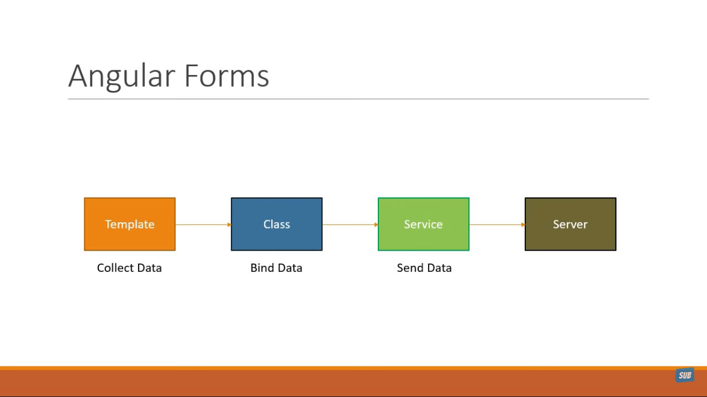
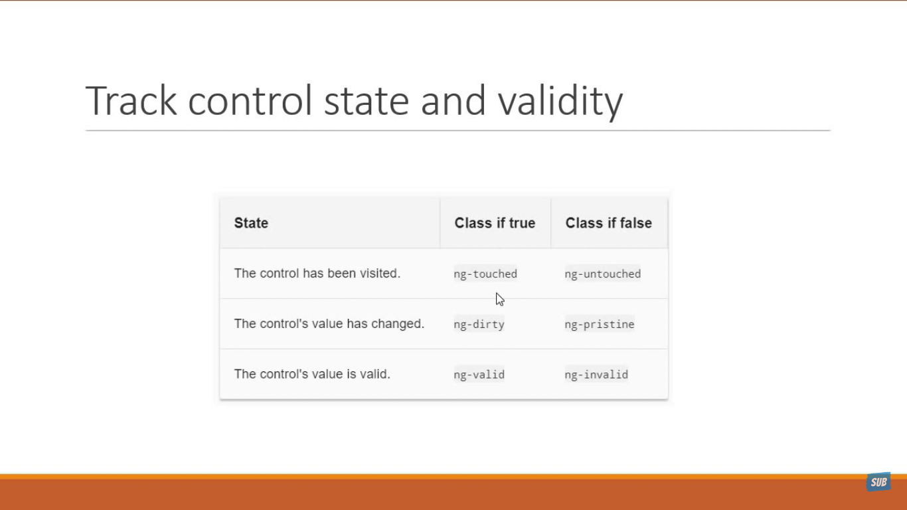

# Angular Notes

## Angular Forms

As a developer we have to handle following in angular forms:
- data binding
- change tracking
- validation
- visual feedback
- error messages
- form submission

prerequisites: **HTML + CSS + JS + Angular Templates, Components, Databinding & Services**

### Angular Form Data Flow 


To achieve above flow, angular provides two approaches:
- Template driven forms(TDF)
    - Heavy on the component template(wrt to code)
- Reactive forms
    - Heavy on the component class(wrt to class code)

### Angular Binding Data With Form Fields:
Whenever we create a form using `<form>` tag angular attaches a `ngForm` directive to the form tag which gives valuable information about the form like
- What are the values of different form controls are
- Whether the values are valid or invalid


### Form Creation
```
<form #userForm="ngForm">
{{ userForm.value }}

Here userForm is the reference to ngForm directive that angular creates.

How to get hold of ngForm directive that angular creates? 
Using Template reference variable (userForm in this case)
```

Note: Make sure that we use `ngModel` directive with every form element where we take input and every form element has name attribute

#### Creating A Subform Inside Of A Form:
```
use ngModelGroup

<div ngModelGroup="address">
</div>

This way we get group related data inside form
```


### Track Control State And Validity
At any point in time, angular applies three classes to a form control based on its state



## Angular Directives
* Angular directives are functions that are executed when they are found on the DOM by angular compiler
* These directives  embed HTML with advanced syntax
* Directives are distinct names either predefined by angular or custom userdefined
* Directive class in angular defined by `@` directive decorator
* Directive provide instructions through with they `transform dom dynamically`


### 4 Types Of Directives
- Component
- Attribute
- Structural
- Custom
