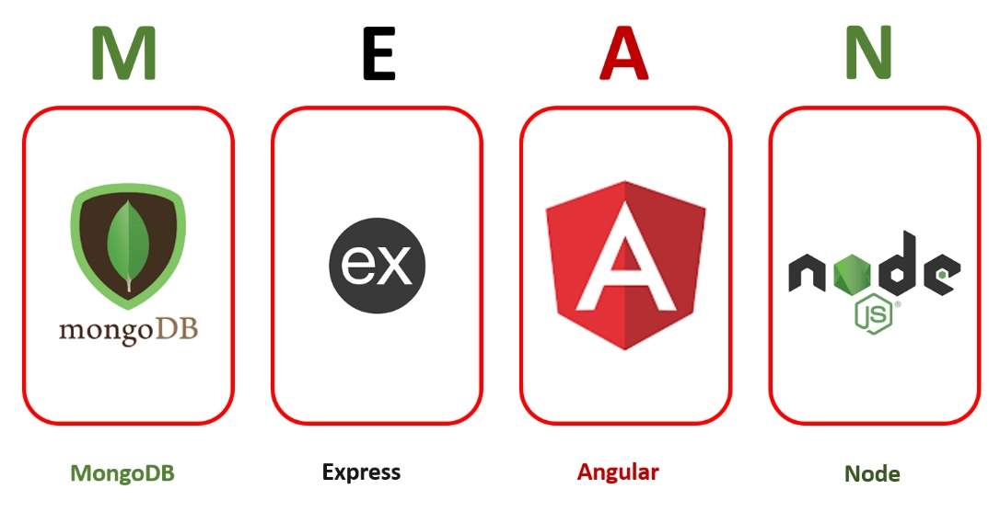
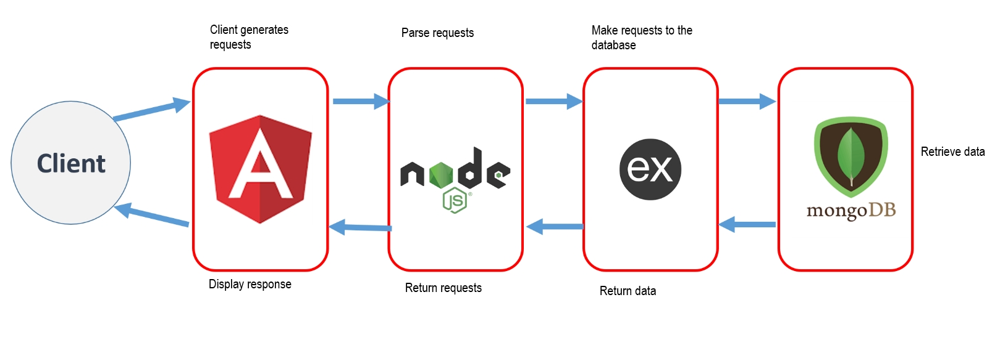

# MEAN Stack

|          Mean Stack           |
| :---------------------------: |
|  |


Reference taken from codevolution mean stack tutorial
Video player application:

1. Angular CLI
2. Express server.
3. Connect angular with express.
4. Mongodb
5. Rest api
6. Test with postman
7. Angular concepts.

------
### MEAN Stack:
- The MEAN stack is comprised of four technologies: MongoDB, Express.js, Angular.js, and Node.js,
- Free open source stack to build web apps
- Is one of the best tools available for solving contemporary business challenges.
- This technology results in low maintenance costs, fewer resources being required, and entails less development time.
- It provides flexibility, high scalability, and several features that help businesses deliver high-performance solutions.
```
MongoDB - NoSQL Database
Express - Web Framework that runs on node.
Angular - Client side development platform
Node - (Javascript) Execution Environment.
```
------
### MEAN Stack Architecture


1. The client first interacts with the user interface, which is built using the Angular frontend framework. 
2. Requests made on the interface are passed to Node.js, the server-side engine. 
3. Then, the middleware framework known as Express.js makes a request to MongoDB, which is the database. 
4. Express.js retrieves the response in the form of data from the database. 
5. Finally, this response is then returned by Node.js to the client via the user display

