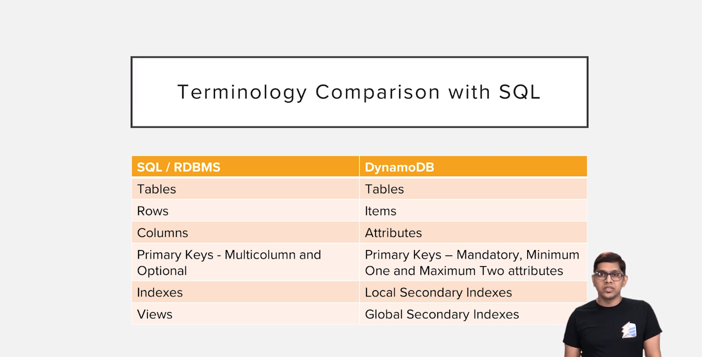

# AWS Dynamodb
+ [Amazon Dynamo Paper](https://www.allthingsdistributed.com/files/amazon-dynamo-sosp2007.pdf)

## NOSQL Databases
- Key-value databases
- Document databases
- Columnar databases
- Graph databases

## CAP Theorem
- Consistency
    - Receive the latest data on every read
- Availability
    - Every requests receives a non-error reply
- Partition tolerance
    - System works despite some packets dropped
  

## Big Data Characteristics
- High Volume
- High Variety
- High Velocity

## Dynamodb is
- Serverless(no need to maintain server or infrastructure as dynamodb is a fully managed service)
- Cloud(is available only as a service from aws cloud)
- NoSQL
- Fast
- Flexible(no schema )
- Cost Effective(pay as per use)
- Highly Scalable
- Fault Tolerant
- Secure

## SQL DB vs DynamoDB



## Dynamodb Basics
- Dynamodb has no concept of having multiple databases
- Tables are the top level entities in dynamodb
- All tables at a given aws region can be looked as a single database
- Tables are 
    - Top level entities
    - Independent Entities
    - Flexible Schema
- Table naming conventions
    - You cannot have two tables with the same name in same aws region
    - Use prefix.table_name or prefix_table_name while naming tables for ease
        - Eg: test.users, test_users
    - We donot have a concept of foreign key releations in dynamodb tables
        - Improves query performance as no joins
        - Also we can provision whatever required capacity for the table
    - No strict schema for tables as we see in sql databases
    - Only mandatory common attribute in dynamodb table is primary key

## Accessing Dynamodb
- Create IAM user with access to Dynamodb
- `aws configure'
- aws dynamodb list-tables

## Dynamodb Introduction
- Data is stored in tables
    - table is collection of items
    - an item consists of attributes
        - name
        - value
- Tables have no schema
- No databases(collection of tables)

Item in Dyanmodb
```json
{ 
  "Id" : "1234",
  "Name" : "john",
  "Title" : "Mr"
}
```

Datatypes
- Dynamodb supports a number of scalar types
- Scalar type means an attribute contains just a single value
- Attribute can be
    - String
    - Number
    - Binary(up to 400KB)
    - Boolean
    - Null
- Attribute in Dyanmodb can also contain multiple values
    - "List" : [1, "Car", true]
- List(any type)
- Set of Strings(unique values)
- Set of Binaries(unique values)
- Set of Numbers(unique values)
- Maps

Partition Key
- Every table should have a partition key attribute
    - Every item should have it
    - Same type in all items
- Each item should have a unique value of the partition key attribute
- Partition Key allows to get a single item

Item Size Limit
- Item should be smaller than 400KB

## Scaling In Dynamodb
Scaling is a process of changing a capacity of a cloud resource depending on a demand for this resource
Two ways to scale
- Provisioned capacity
    - Specify expected read/write throughput
- On-demand capacity
    - Database scales according to the demand

### Provisioned Capacity
- Directly specify how much throughput you need
- Define capacity per table(amount of RCUs and WCUs)
- Can change at any time
- Price depends on provisioned capacity

### Capacity Units
- Each table has RCU/WCU values
- 1 RCU
    - Read up to 4KB per second
- 1 WCU
    - Write up to 1KB per second
 
