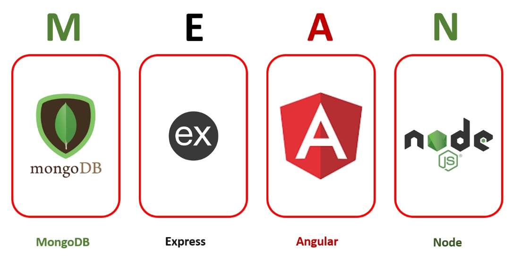
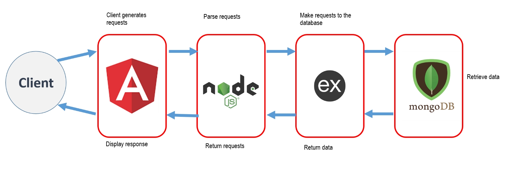

Reference taken from codevolution mean stack tutorial
Video player application:
1. Angular CLI
2. Express server.
3. connect angular with express.
4. mongodb
5. rest api
6. test with postman
7. angular concepts.


### MEAN Stack:
- The MEAN stack is comprised of four technologies: MongoDB, Express.js, Angular.js, and Node.js,
- free open source stack to build web apps
- is one of the best tools available for solving contemporary business challenges.
- This technology results in low maintenance costs, fewer resources being required, and entails less development time.
- It provides flexibility, high scalability, and several features that help businesses deliver high-performance solutions.
```
MongoDB - NoSQL Database
Express - Web Framework that runs on node.
Angular - Client side development platform
Node - (Javascript) Execution Environment.
```

### MEAN Stack Architecture


